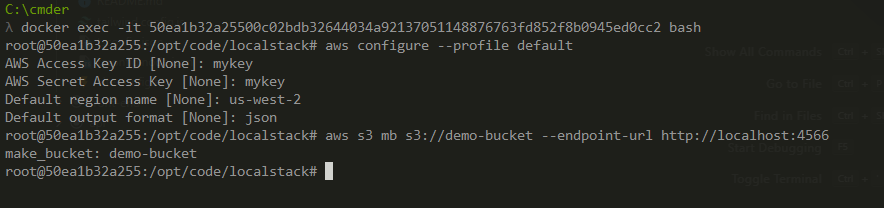

# Front-End SysMap Parrot
### Rede social desenvolvida para o Bootcamp da empresa SysMap Solutions

### Tecnologias
- Vite
- Typescript
- React
- TailwindCSS
- Axios

### Repositório do Backend
- https://github.com/LuanC14/NetSys_Parrot_Backend

### Como executar a aplicação

##### Front-End:
- ```https://github.com/bc-fullstack-03/luan-chrystian-frontend ``` Para clonar o repositório na sua IDE
- ```npm install ``` Para instalar as dependências necessárias
- ```npm run dev ``` Para executar o Front-End

##### Back-End:
É necessário ter o Docker instalado para executar a aplicação localmente.
- ```git clone https://github.com/LuanC14/NetSys_Parrot_Backend.git ``` Para clonar o repositório na sua IDE
- ```docker-compose up -d  ``` Para criar os contêineres do MongoDB e do LocalStack (Bucket-S3) 
- Realizados estes comandos, basta buildar e executar o backend na sua IDE.

##### ! Caso o Bucket-S3 do LocalStack não tenha persistido durante o processo, siga estes passos:
- Executar o contêiner do Localstack: ```` docker exec -it IdDoContêinerLocalStack bash ````
- Inicializar a shell do AWS através do comando ``` aws configure --profile default ```
- Preencher o restante dos campos conforme a imagem.



### Apresentação do Projeto no Linkedin:
O projeto do link corresponde ao que está no meu repositório, nele contém novas features e correções que optei em deixar separado, mantendo aqui somente o que consegui realizar dentro do prazo.
https://www.linkedin.com/feed/update/urn:li:activity:7069074342633947136/

---


### Demonstração: Versão 1.0.0
Features demonstradas em vídeo: 
- Login; 
- Alteração da foto do perfil e outros dados de usuário e biografia; Criando uma publicação; 
- Buscando um usuário no Input da tela Social; 
- Follow e unfollow; Curtindo publicação de usuário; 
- Comentando publicação de usuário e Logout;

https://github.com/bc-fullstack-03/luan-chrystian-frontend/assets/107001881/990cbfab-83ab-4b67-b4e5-86446d16b332

Caso o vídeo não esteja disponível: https://youtu.be/lMehuiGR5DE

### Pontos adicionais
- Disponível breakpoints personalizados de responsividade, desde para telas grandes, pequenas e mobile.
- Disponível um componente exibido durante execução das promises
- Na versão mobile algumas telas deixei indisponíveis, como por exemplo a de criação de publicação e alteração de dados do perfil por conta de alguns inconvenientes temporários em relação a responsividade.

##### Obs: Tentarei fazer o deploy da aplicação e conectar ao backend até 00:00


